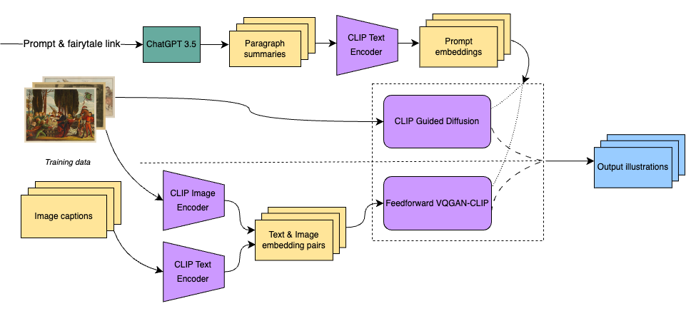
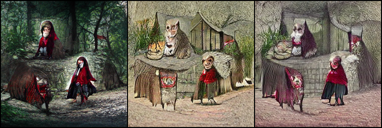
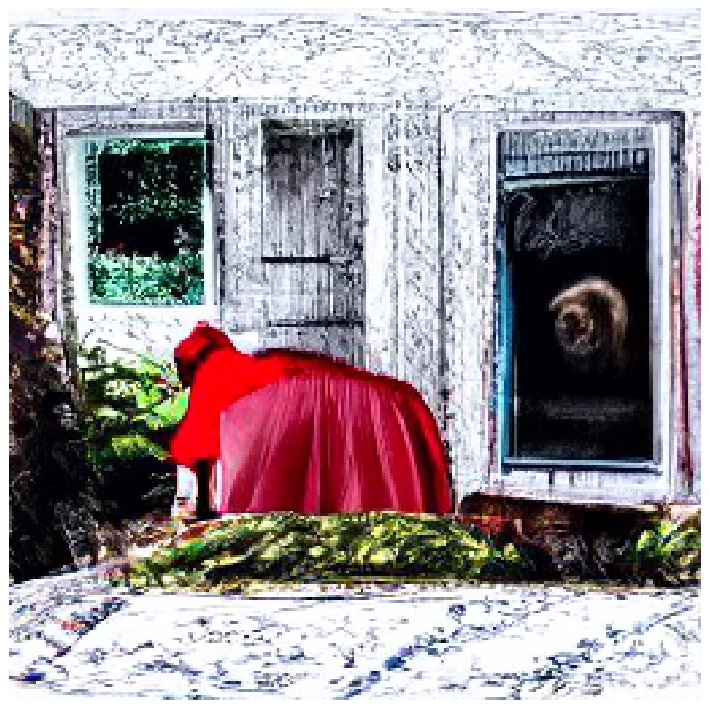

#  Once upon a Diffision

In this study, we explore the application of generative models in dynamically creating descriptive images from fairy tales for educational purposes, aiming to enhance language learning and comprehension among children. We proposed a pipeline for adapting Clip-Guided diffusion model to fairy tale content, utilizing techniques like textual inversion to fine-tune the models. Additionally, we compare the performance of Clip-Guided diffusion model and Clip-Guided VQGAN in generating fairy tale descriptor images, evaluating their efficiency.

### Feed forward VQGAN-CLIP
Feed forward VQGAN-CLIP model, where the goal is to eliminate the need for optimizing the latent space of VQGAN for each input prompt. This  is done by training a model that takes as input a text prompt, and returns as an output the VQGAN latent space, which is then transformed into an RGB image. The model is trained on a dataset of text prompts
and can be used on unseen text prompts. The loss function is minimizing the distance between the CLIP generated image features and the CLIP input text features. Additionally, a diversity loss can be used to make increase the diversity of the generated images given the same prompt.

### CLIP-Guided Diffusion
This architecture is essentially a U-Net based on a Wide ResNet framework, with the substitution of group normalization for weight normalization to streamline implementation. Each model consists of two convolutional residual blocks per resolution level. Additionally, multi-head self-attention blocks are incorporated at the 16×16 and 8×8 resolution levels, positioned between the convolutional blocks. 

### Pipeline for the fairytale project:



### Output of our model:

Prompt: "Little Red Riding Hood with her bright red hood and innocent face wanders through the dark and eerie woods unaware of the danger lurking nearb"



### Install dependencies. 

```bash
conda create -n ff_vqgan_clip_env python=3.8
conda activate ff_vqgan_clip_env
# Install pytorch/torchvision - See https://pytorch.org/get-started/locally/ for more info.
(ff_vqgan_clip_env) conda install pytorch torchvision torchaudio cudatoolkit=11.1 -c pytorch -c nvidia
(ff_vqgan_clip_env) pip install -r requirements.txt
```

### Train

Modify `configs/example.yaml` as needed.  

```
$ (ff_vqgan_clip_venv) python main.py train configs/example.yaml
```

### Test
```
`python -u main.py test cc12m_32x1024_vitgan.th "Prompt"`
```

# Acknowledgements
- Thanks to VitGAN authors, the VitGAN model is from <https://github.com/wilile26811249/ViTGAN>
- Thanks to CompVis for Taming Transformers <https://github.com/CompVis/taming-transformers>, the code uses VQGAN pre-trained model and
VGG16 feature space perceptual loss <https://github.com/CompVis/taming-transformers/blob/master/taming/modules/losses/lpips.py>
- Thanks to [OpenCLIP](https://github.com/mlfoundations/open_clip) authors for CLIP-like code/models pre-trained on LAION-400M and LAION-2B
